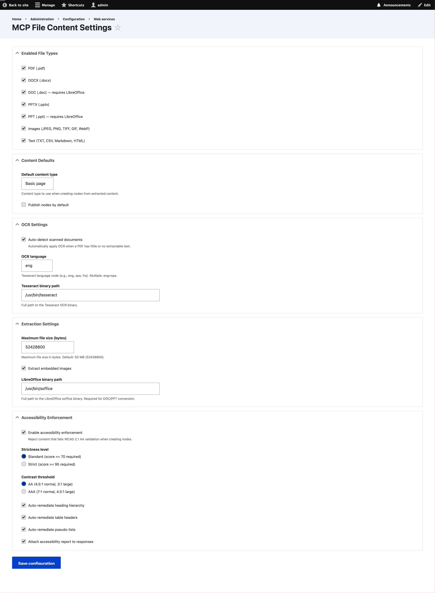
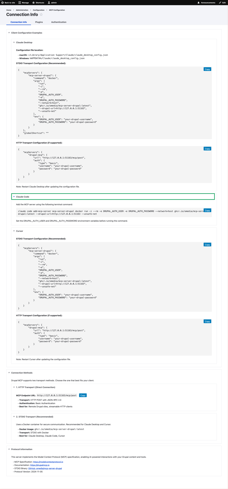
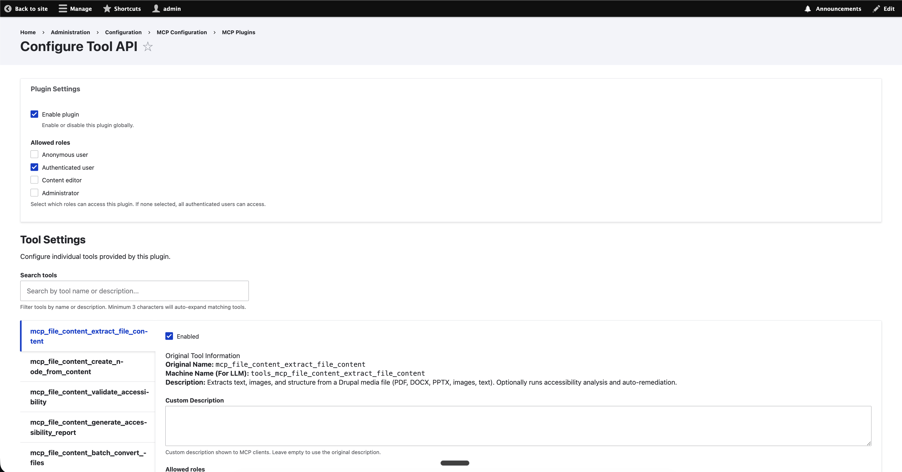
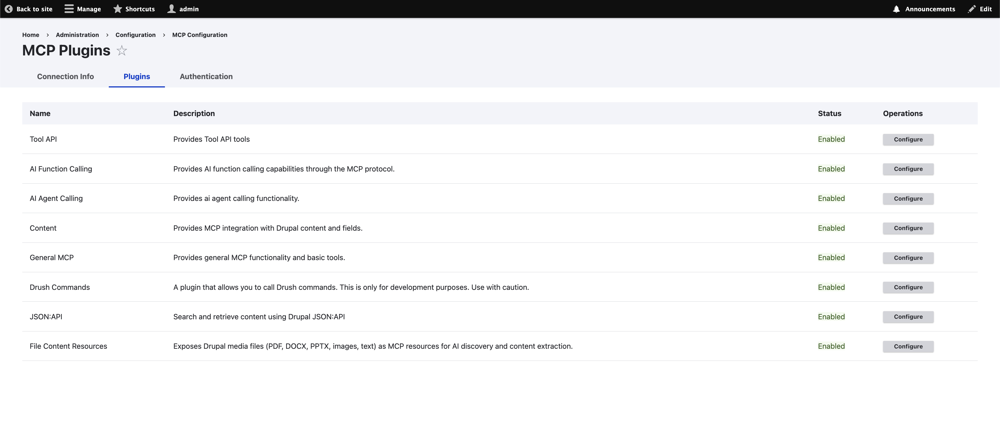

# MCP File Content

A Drupal 11 module that enables AI clients to discover files on a Drupal site via the
[Model Context Protocol (MCP)](https://modelcontextprotocol.io/), extract their content,
automatically remediate accessibility issues, and create ADA-compliant (WCAG 2.1 AA) content nodes.

Streamlines the conversion of uploaded documents into accessible web content.

## What It Does

1. **File Discovery** -- Exposes Drupal media entities (PDFs, Word docs, PowerPoints, images,
   text files) as MCP resources that AI clients can browse and read.
2. **Content Extraction** -- Pulls text, headings, tables, lists, and images out of uploaded
   files and converts them to structured HTML.
3. **Accessibility Validation** -- Runs 7 independent WCAG 2.1 AA checks against extracted
   or authored HTML and returns a compliance score (0--100) with actionable error descriptions.
4. **Auto-Remediation** -- Fixes common accessibility problems server-side without AI
   involvement: heading hierarchy gaps, missing table headers, pseudo-lists written as
   paragraphs.
5. **Node Creation** -- Creates Drupal content nodes from extracted HTML, optionally blocking
   creation when the content does not meet accessibility standards.
6. **Batch Processing** -- Converts multiple files in one call with per-file error handling.
7. **Reporting** -- Generates accessibility audit reports in JSON, HTML, or CSV for existing
   site content.

## How It Works with AI Clients

Once installed on your Drupal site, any MCP-compatible AI client (Claude Desktop, Cursor,
Windsurf, custom agents, etc.) can connect to your site's MCP server endpoint and use the
tools and resources this module provides.

**Example workflow** -- an AI client can:

1. List all media files on the site via MCP resources
2. Extract content from each file (PDFs, DOCX, PPTX, images via OCR)
3. Run WCAG 2.1 AA accessibility checks on the extracted HTML
4. Auto-remediate common issues (heading hierarchy, table headers, pseudo-lists)
5. Create ADA-compliant content nodes from the remediated HTML
6. Generate audit reports of existing site content

This can be done file-by-file or in batch, and the AI client can orchestrate the entire
pipeline in a single conversation.

## MCP Server Plugins

When combined with the Drupal MCP ecosystem, your site exposes **8 MCP plugins** that give
AI clients broad access to site functionality. These are managed at **Administration >
Configuration > Web Services > MCP Settings** (`/admin/config/services/mcp`).

| Plugin | Module | Description |
|--------|--------|-------------|
| **Tool API** | `drupal/tool` | Exposes all Tool API plugins (including the 6 custom tools below) to MCP clients |
| **AI Function Calling** | `drupal/ai` | Exposes AI provider function-calling capabilities via MCP |
| **AI Agent Calling** | `drupal/ai_agents` | Exposes AI agent orchestration and multi-step task execution via MCP |
| **Content** | `drupal/mcp` | Provides content entity CRUD operations (nodes, taxonomy, etc.) |
| **General MCP** | `drupal/mcp` | Core MCP protocol support -- server info, capability negotiation |
| **Drush Commands** | `drupal/mcp` | Exposes Drush CLI commands as MCP tools |
| **JSON:API** | `drupal/mcp` | Exposes Drupal's JSON:API endpoints for structured data access |
| **File Content Resources** | `mcp_file_content` | Custom plugin -- media discovery, file reading, content extraction |

## Requirements

### Drupal Modules

| Module | Purpose |
|--------|---------|
| `drupal/mcp` (>=1.2) | MCP server protocol (JSON-RPC, plugin system) |
| `drupal/tool` (>=1.0) | Tool API plugin framework |
| `drupal/ai` (>=1.2) | AI provider abstraction and function calling |
| `drupal/ai_agents` (>=1.2) | AI agent orchestration framework |
| `drupal/gemini_provider` (>=1.0) | Google Gemini AI provider (or another supported provider) |
| `drupal:media` | Media entity management (core) |
| `drupal:file` | File entity storage (core) |
| `drupal:node` | Content node creation (core) |

### PHP Libraries

| Package | Purpose |
|---------|---------|
| `smalot/pdfparser` ^2.0 | PDF text extraction |
| `phpoffice/phpword` ^1.0 | DOCX/DOC reading |
| `thiagoalessio/tesseract_ocr` ^2.0 | OCR for scanned documents and images |

### System Dependencies

These must be installed on the web server (or in the DDEV/Docker container):

| Binary | Package | Purpose |
|--------|---------|---------|
| `tesseract` | `tesseract-ocr`, `tesseract-ocr-eng` | Optical character recognition |
| `soffice` | `libreoffice-writer` | DOC/PPT to DOCX/PPTX conversion |
| `pdftoppm` | `poppler-utils` | PDF page-to-image for OCR fallback |

## Installation

### 1. Install the module and dependencies

```bash
# PHP libraries
composer require smalot/pdfparser:^2.0 phpoffice/phpword:^1.0 thiagoalessio/tesseract_ocr:^2.0

# Drupal modules
composer require drupal/mcp:^1.0@alpha drupal/tool:1.0.x-dev@dev
composer require drupal/ai:^1.2 drupal/ai_agents:^1.2 drupal/gemini_provider:^1.0@beta
```

### 2. Place this module

Copy or clone this module into your Drupal installation:

```bash
# Option A: Clone directly
git clone https://github.com/johnnyphung-laccd/drupal-mcp-file-content.git \
  web/modules/custom/mcp_file_content

# Option B: Copy manually
cp -r mcp_file_content/ /path/to/drupal/web/modules/custom/
```

### 3. Install system dependencies

**DDEV** -- create `.ddev/web-build/Dockerfile`:

```dockerfile
RUN apt-get update && apt-get install -y \
    tesseract-ocr \
    tesseract-ocr-eng \
    libreoffice-writer \
    poppler-utils \
    && apt-get clean && rm -rf /var/lib/apt/lists/*
```

Then run `ddev restart`.

**Debian/Ubuntu server:**

```bash
sudo apt-get install tesseract-ocr tesseract-ocr-eng libreoffice-writer poppler-utils
```

### 4. Enable the modules

```bash
drush en mcp media file node tool mcp_file_content -y
drush en ai ai_agents gemini_provider -y
drush cr
```

### 5. Configure AI provider

Navigate to **Administration > Configuration > AI > AI Settings** (`/admin/config/ai/settings`)
and configure your preferred AI provider:

- **Google Gemini** -- Enter your Gemini API key under the Gemini provider settings. Gemini
  2.0 Flash is recommended as the default model for chat and function calling.
- Other supported providers (OpenAI, Anthropic, etc.) can be installed via their respective
  Drupal modules.

### 6. Enable MCP plugins

Navigate to **Administration > Configuration > Web Services > MCP Settings**
(`/admin/config/services/mcp`) and enable the desired plugins. All 8 plugins listed in
the [MCP Server Plugins](#mcp-server-plugins) section are recommended.

### 7. Grant permissions

Go to **Administration > People > Permissions** (`/admin/people/permissions`) and assign
permissions to the appropriate roles. See the [Permissions](#permissions) section below.

## Configuration

Navigate to **Administration > Configuration > Web Services > MCP File Content**
(`/admin/config/services/mcp-file-content`).

The settings form is organized into five sections:

### Enabled File Types

Toggle support for each file format:

- **PDF** -- via `smalot/pdfparser` with OCR fallback
- **DOCX** -- via `phpoffice/phpword`
- **DOC** -- converted to DOCX via LibreOffice, then extracted
- **PPTX** -- parsed as ZIP/XML
- **PPT** -- converted to PPTX via LibreOffice, then parsed
- **Images** (JPEG, PNG, TIFF, GIF, WebP) -- OCR via Tesseract
- **Text** (plain text, CSV, Markdown, HTML)

### Content Defaults

- **Default content type** -- the node bundle used when creating nodes (default: `page`)
- **Publish status** -- whether newly created nodes are published immediately

### OCR Settings

- **Auto-detect scanned documents** -- triggers OCR when a PDF page has fewer than 100
  characters of extractable text
- **OCR language** -- Tesseract language code (`eng`, `spa`, etc.)
- **Tesseract path** -- absolute path to the `tesseract` binary

### Extraction Settings

- **Max file size** -- rejects files larger than this (default: 50 MB)
- **Extract images** -- include embedded images as base64 in extraction output
- **LibreOffice path** -- absolute path to the `soffice` binary

### Accessibility Enforcement

- **Enable enforcement** -- when on, node creation is blocked if the content score is below
  the compliance threshold
- **Strictness** -- `standard` (score >= 90 to pass) or `strict` (score >= 95)
- **Contrast threshold** -- `AA` (4.5:1 normal, 3:1 large) or `AAA` (7:1 normal, 4.5:1 large)
- **Auto-remediate headings** -- fix skipped heading levels (e.g., H1 to H3 becomes H1 to H2)
- **Auto-remediate tables** -- add `<th scope="col">` to first-row cells
- **Auto-remediate lists** -- convert dash/bullet paragraphs to `<ul>`/`<ol>` markup
- **Attach report** -- include an accessibility report with node creation results

## MCP Tools

Six tools are exposed to MCP clients via the Tool API. They appear automatically in MCP tool
listings.

### extract_file_content

Extracts text, structure, and images from a media entity. Optionally runs accessibility
analysis and auto-remediation.

| Input | Type | Required | Description |
|-------|------|----------|-------------|
| `media_id` | integer | yes | Drupal media entity ID |
| `extract_images` | boolean | no | Include base64 images (default: true) |
| `ocr_enabled` | boolean | no | Enable OCR fallback (default: true) |
| `ocr_language` | string | no | Tesseract language code (default: `eng`) |
| `analyze_accessibility` | boolean | no | Run WCAG audit (default: true) |

Returns: extracted HTML content, title, metadata, document structure, accessibility audit
results, and auto-remediation details.

### validate_accessibility

Runs WCAG 2.1 AA validation against an HTML string.

| Input | Type | Required | Description |
|-------|------|----------|-------------|
| `html_content` | string | yes | HTML to validate |
| `check_images` | boolean | no | Check alt text (default: true) |
| `check_headings` | boolean | no | Check heading hierarchy (default: true) |
| `check_contrast` | boolean | no | Check color contrast (default: true) |
| `check_tables` | boolean | no | Check table headers (default: true) |
| `check_links` | boolean | no | Check link text (default: true) |
| `check_language` | boolean | no | Check lang attribute (default: true) |
| `check_lists` | boolean | no | Check for pseudo-lists (default: true) |
| `strict_mode` | boolean | no | Use strict threshold (default: false) |

Returns: pass/fail status, score, errors and warnings with WCAG criterion references,
and remediation suggestions.

### create_node_from_content

Creates a Drupal content node from HTML. Validates accessibility before creation when
enforcement is enabled.

| Input | Type | Required | Description |
|-------|------|----------|-------------|
| `title` | string | yes | Node title |
| `body` | string | yes | HTML body content |
| `content_type` | string | no | Node bundle (default: from config) |
| `body_format` | string | no | Text format (default: `full_html`) |
| `status` | boolean | no | Published status (default: from config) |
| `source_media_id` | integer | no | Link to source media entity |
| `language` | string | no | Language code |
| `enforce_accessibility` | boolean | no | Block if non-compliant (default: from config) |
| `accessibility_report` | boolean | no | Include audit in response (default: from config) |

Returns: node ID, URL, accessibility score, compliance status, and any issues found.

### list_content_types

Lists available content types and their fields.

| Input | Type | Required | Description |
|-------|------|----------|-------------|
| `content_type` | string | no | Filter to a specific bundle |

Returns: array of content types with machine names, labels, descriptions, and field
definitions.

### batch_convert_files

Extracts, remediates, validates, and creates nodes from multiple media entities in one call.

| Input | Type | Required | Description |
|-------|------|----------|-------------|
| `media_ids` | string | yes | Comma-separated media entity IDs |
| `content_type` | string | no | Node bundle (default: from config) |
| `status` | boolean | no | Published status (default: false) |
| `ocr_enabled` | boolean | no | Enable OCR (default: true) |
| `enforce_accessibility` | boolean | no | Block non-compliant (default: from config) |
| `skip_on_failure` | boolean | no | Continue on error (default: true) |

Returns: per-file results (node IDs, scores) and failure details, plus a summary with
total/succeeded/failed counts.

### generate_accessibility_report

Audits existing content nodes and produces a formatted report.

| Input | Type | Required | Description |
|-------|------|----------|-------------|
| `node_ids` | string | no | Comma-separated node IDs |
| `content_type` | string | no | Audit all nodes of this bundle |
| `output_format` | string | no | `json`, `html`, or `csv` (default: `json`) |
| `include_remediation` | boolean | no | Include fix suggestions (default: true) |

Returns: formatted report with per-node scores, errors, warnings, and remediation actions.

## MCP Resources

The module registers an MCP resource provider that exposes media entities for AI discovery.

### Resource URI Scheme

- `drupal://media/{bundle}/{id}` -- read a specific media entity
- `drupal://media/documents` -- list all document media
- `drupal://media/images` -- list all image media
- `drupal://media/presentations` -- list all presentation media
- `drupal://media/all` -- list all supported media

### Behavior

- **Listing** returns metadata: URI, name, filename, MIME type, file size.
- **Reading a document** extracts and returns the text content as HTML.
- **Reading an image** returns the base64-encoded image data.

## Permissions

| Permission | Description |
|------------|-------------|
| Access MCP file resources | List and read files via MCP resources |
| Extract file content via MCP | Use the `extract_file_content` tool |
| Create content via MCP | Use the `create_node_from_content` tool |
| Validate accessibility via MCP | Use the `validate_accessibility` tool |
| Generate accessibility report via MCP | Use the `generate_accessibility_report` tool |
| Batch convert files via MCP | Use the `batch_convert_files` tool |
| Bypass accessibility enforcement | Create nodes without WCAG validation (restricted) |
| Administer MCP File Content | Access the configuration page (restricted) |

## Accessibility Checks

The module validates HTML against seven WCAG 2.1 AA criteria:

| Checker | WCAG Criteria | What It Detects |
|---------|--------------|-----------------|
| Color contrast | 1.4.3 | Inline styles with insufficient contrast ratios |
| Heading hierarchy | 1.3.1, 2.4.6, 2.4.10 | Skipped levels, empty headings, missing H1, generic text |
| Alt text | 1.1.1 | Missing `alt` attributes, filename-as-alt, empty decorative alt |
| Link text | 2.4.4 | Generic text ("click here", "read more"), bare URLs, empty links |
| List markup | 1.3.1 | Consecutive paragraphs that should be `<ul>` or `<ol>` |
| Table headers | 1.3.1 | Missing `<th>`, missing `scope` attribute, missing `<caption>` |
| Language | 3.1.1 | Missing `lang` attribute on the root element |

### Scoring

Scores start at 100 and are reduced per issue:

- Alt text error (1.1.1): -5
- Heading/table/contrast error (1.3.1, 1.4.3): -3
- Link text/language error (2.4.4, 3.1.1): -2
- No headings in long content (2.4.10): -5
- Any warning: -1

A score of 90+ is considered compliant in standard mode; 95+ in strict mode.

### Auto-Remediation

These fixes are applied automatically during extraction (no AI required):

- **Heading hierarchy** -- renumbers headings to eliminate skipped levels
- **Table headers** -- converts first-row `<td>` to `<th scope="col">`
- **Pseudo-lists** -- converts consecutive dash/bullet paragraphs to `<ul><li>` or `<ol><li>`

## Screenshots

| Screenshot | Description |
|------------|-------------|
|  | Module configuration form with file type toggles, OCR settings, and accessibility enforcement options |
|  | MCP connection info showing the server endpoint URL for AI clients |
|  | Tool API plugin configuration showing enabled tools with descriptions and role-based access |
|  | All 8 MCP plugins enabled: Tool API, AI Function Calling, AI Agent Calling, Content, General MCP, Drush Commands, JSON:API, File Content Resources |

## Architecture

```
src/
  Exception/                      # ExtractionException, FileTooLargeException, UnsupportedFileTypeException
  Form/
    SettingsForm.php              # Admin configuration form
  Plugin/
    Mcp/
      FileContentResources.php    # MCP resource provider (media discovery + reading)
    tool/Tool/
      ExtractFileContentTool.php  # Tool API plugins (6 tools)
      ValidateAccessibilityTool.php
      CreateNodeFromContentTool.php
      ListContentTypesTool.php
      BatchConvertFilesTool.php
      GenerateAccessibilityReportTool.php
  Service/
    Extractor/
      ExtractorInterface.php      # Common interface for all extractors
      PlainTextExtractor.php      # text/plain, text/csv, text/markdown, text/html
      PdfExtractor.php            # application/pdf (with OCR fallback)
      DocxExtractor.php           # DOCX and DOC (via LibreOffice conversion)
      PptxExtractor.php           # PPTX and PPT (via LibreOffice conversion)
      ImageExtractor.php          # image/* (via Tesseract OCR)
    FileExtractorManager.php      # Routes files to the correct extractor by MIME type
    AccessibilityValidator.php    # Orchestrates all 7 checkers, computes score
    AccessibilityRemediator.php   # Applies deterministic HTML fixes
    AccessibilityReportGenerator.php  # JSON/HTML/CSV report generation
    NodeCreator.php               # Creates Drupal nodes with accessibility enforcement
    ColorContrastChecker.php      # WCAG 1.4.3 contrast ratio calculation
    HeadingHierarchyAnalyzer.php  # WCAG 1.3.1 heading structure analysis
    AltTextRequirementChecker.php # WCAG 1.1.1 image alt text validation
    LinkTextChecker.php           # WCAG 2.4.4 link text quality
    ListMarkupChecker.php        # WCAG 1.3.1 pseudo-list detection
    TableAccessibilityChecker.php # WCAG 1.3.1 table header validation
    LanguageChecker.php           # WCAG 3.1.1 lang attribute check
```

## Running Tests

The module includes 63 unit tests covering all extractors and accessibility checkers.

```bash
# All tests (from Drupal root)
cd web && ../vendor/bin/phpunit -c core/phpunit.xml.dist modules/custom/mcp_file_content/tests/src/Unit/

# Extractor tests only
cd web && ../vendor/bin/phpunit -c core/phpunit.xml.dist modules/custom/mcp_file_content/tests/src/Unit/Extractor/

# Accessibility service tests only
cd web && ../vendor/bin/phpunit -c core/phpunit.xml.dist modules/custom/mcp_file_content/tests/src/Unit/Service/
```

With DDEV:

```bash
ddev exec bash -c 'cd /var/www/html/web && ../vendor/bin/phpunit -c core/phpunit.xml.dist modules/custom/mcp_file_content/tests/src/Unit/'
```

## Test Data Generation

A script is included to generate synthetic test files for development and testing:

```bash
ddev exec php web/modules/custom/mcp_file_content/tests/generate_test_data.php
```

This creates 12 files in `/tmp/test-files/` including valid DOCX documents and intentionally
broken files (skipped headings, missing alt text, low contrast, pseudo-lists, tables without
headers) for verifying accessibility detection.

To create Drupal media entities from the test files:

```bash
ddev drush php:script web/modules/custom/mcp_file_content/tests/create_media_entities.php
```

## License

This project is licensed under the GPL-2.0-or-later license, consistent with Drupal core.
